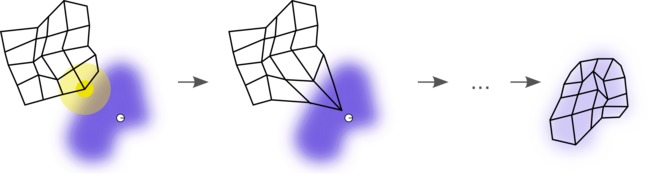
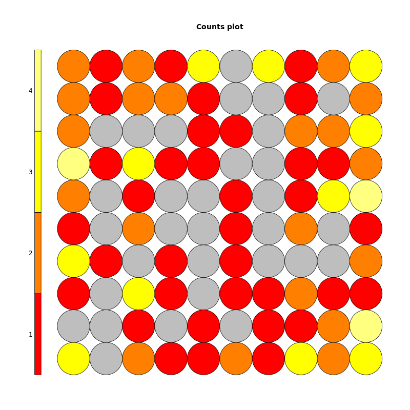
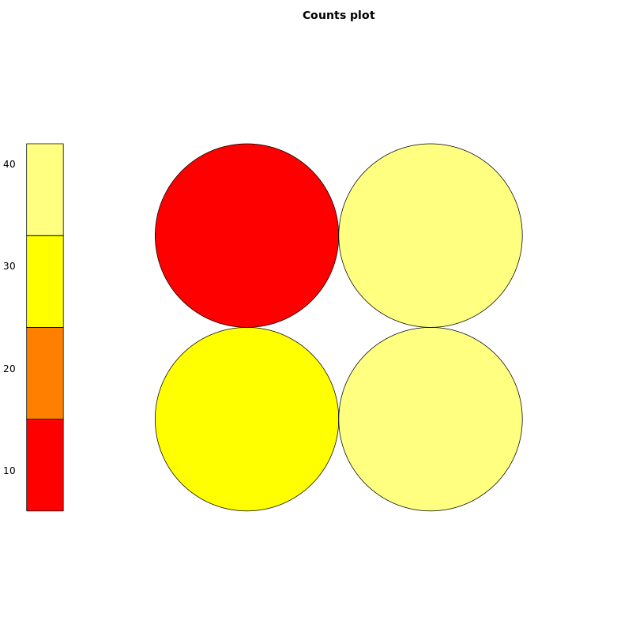
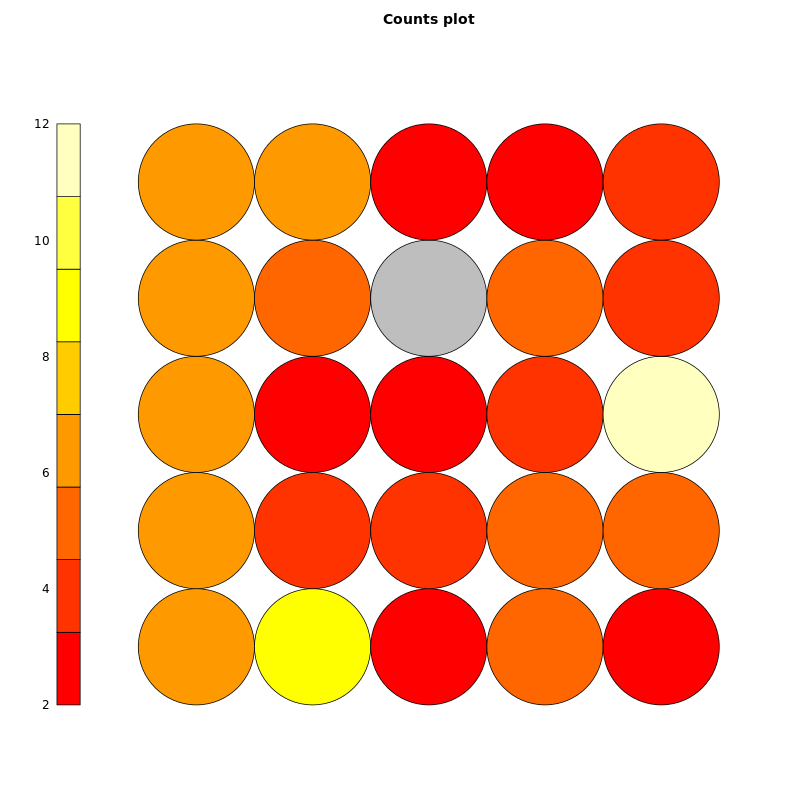
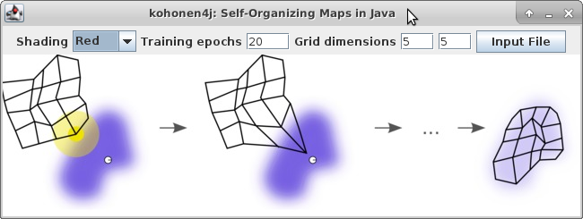
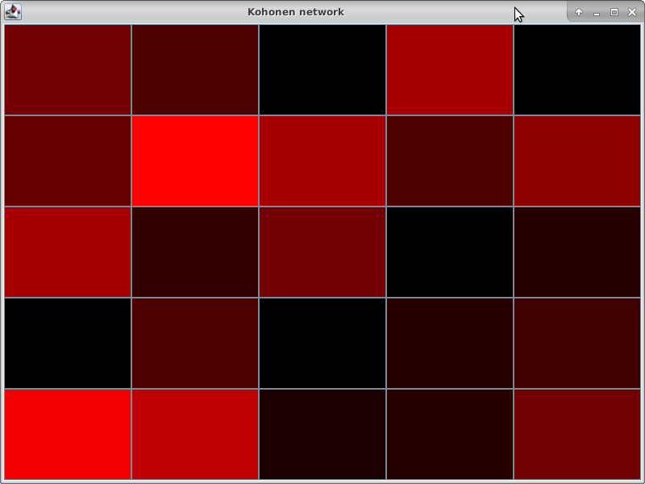

#kohonen4j: Self-Organizing Maps for Java

## Introduction
  Introduced by Teuvo Kohonen in 1982, self-organizing maps have become an important algorithm in the field of artificial intelligence for unsupervised learning and clustering. Supervised extensions to the technique have also been introduced: the bi-directional Kohonen map applies this idea. When applied to data with input features, the technique is useful for identifying observations that share similarities. For example, if motor vehicles were described using data with their weight, length, number of wheels, horsepower, and passenger capacity, trucks from different manufacturers would be grouped together into a cluster, as would SUVs, but both of these clusters would be closer together than clusters for compact cars or motorcycles. The algorithm performs clustering by grouping observations close to one another in terms of the standardized distance of their predictors: since distance is dependent on scale and multiple predictors will frequently not have the same units, predictors are routinely centered at zero and given unit variance so that variation in one dimension receives the same weight as in another dimension. Importantly, self-organizing maps can summarize high-dimensional data from an n-dimensional space to a 2 dimensional space mapping, and this dimensionality reduction makes visualization less unwieldy for humans compared to the original problem.
  
  Kohonen networks—another name for self-organizing maps—share interesting similarities with a multitude of other techniques, and Kohonen networks bridge several common tasks in machine learning. For this reason they can be utilized to solve a wide range of problems. The versatility of extensions to self-organizing maps is perhaps unrivaled amongst other techniques. Although calculated in a different manner than self-organizing maps, k-means clustering and hierarchical clustering can be applied to the same classification problem of grouping similar observation, and principal component analysis also reduces the dimensionality of an input, grouping observations into orthogonal spaces with distances representing similarity. Kohonen networks can perform this task in a supervised (labeled data with an outcome) or unsupervised (unlabeled data with observations only and no outcome variable) environment. As a relative to other artificial neural networks, training on a dataset occurs through iterative passes over the data that reduce the mean distance from each observation to its assigned node. Known as online training, this approach allows the maps to incorporate new data without having to process all of the original data again, an approach that is useful for both “Big Data” tasks and systems with input data from sensors that require low latency for calculating a response. Finally, self-organizing maps can be applied and used for prediction for both regression (continuous dependent variable) or classification (discrete dependent variable). For comparison, dimensionality reduction techniques like principal component analysis is an offline-only algorithm that only operates on regression problems and the elastic net model only applies to offline regression tasks. The Wikipedia figure below illustrates the training process for the blue data, the yellow node, and the wireframe map.

First, a 2D N x M grid is selected as the map. This grid is initialized with random samples from the training data; the training process is not deterministic, and two maps trained on the same data with the same parameters will therefore likely not be identical. For each observation in the dataset (white point), the closest node (yellow, called the best matching unit) is identified. The map is then “pulled” toward that observation for all nodes in an appropriate neighborhood around the best matching unit. This occurs for every observation in the training set to complete training for one epoch. The whole process is then repeated for a number of training epochs until the map approximates the original data in a lower dimensional space. The training process usually uses an adaptive learning rate and neighborhood radius: initially a large radius is used to pull many nodes down around the best matching unit, and the nodes are pulled down by a large amount, but as training progresses the neighborhood radius shrinks so that only the best matching unit is pulled, and the amount that the nodes are pulled down is reduced through a smaller learning rate.
	Mean distance should decrease (mostly) monotonically—although not necessarily since a greedy algorithm for each best matching unit is used—until ideally an asymptotic minimum is reached. A parameter in the kohonen4j program will allow the user to specify the number of fitting rounds and map dimensions, the two tuning parameters exposed to the user. A random matrix is initialized with samples from the original data without replacement. The output dimensions for the map must be specified, but defaults are provided. This dimension is a difficult parameter to select a priori, and this is where kohonen4j serves a useful task. If the output map is too large of a grid, many cells will be empty and not be selected as a best matching unit, resulting in an unnecessarily complex model that overfits the data. In contrast, if the selected maps is too small, cells will be selected as a best matching unit too frequently, leading to insufficient separation between dissimilar observations. A reasonable configuration occurs when each cell has five to ten observations and very few or no empty cells. In general the more observations and fewer predictors, the larger map we will need, but the signal strength of the predictors also influences the distribution of cells: random predictors will be more uniformly distributed between all cells, while a few very strong predictors will concentrate counts in a few “hot spots” on the map. Furthermore, the number of training epochs can impact the convergence of the map. More epochs generally lead to maps with a tighter fit to the data, but this once again comes at the potential cost of overfitting. Too few training epochs runs the opposite risk. Visual inspection of the counts falling into each cell serves as a useful diagnostic for assessing the fitted network’s quality.
## Implementation
The kohonen4j program allows the user to quickly load data, specify the map dimensions, and plot the resulting map cell counts. Many refinements to the Kohonen network can be made—from the step update size to the network geometry, distance measure, learning rate, neighborhood radius, and initialization method—but these are not the focus of kohonen4j. Some of these extensions could be incorporated fairly easily: the train() method in the SOM class already calculates node distances, so all that is needed for plotting this measure of network quality is a scaling method for the distances and an approach for visualization. Regardless, the program seeks solely to meet the need of assessing the appropriate network map size and training epochs. Using the produced diagnostic plot, the user can then adjust the size of the map to select an optimal map result for that particular dataset. The graphics below were created in the statistical software R and illustrate the cases of underfit, overfit, and reasonable map size on the “wines” dataset included in the “kohonen” package. This data has variables such as alcohol content, magnesium levels, malic acid strength, flavanoid content, etc. The first graph shows a network with far too many cells. Empty cells are represented with gray. The training set data consists of 177 observations with 13 predictors. Since this was applied to a 10 x 10 map, we would expect on average 1.7 observations per cell, and some cells would be empty by chance. However, with useful predictors carrying clustering information we would expect even more empty cells as we see below.

In contrast to the map above that overfits the data, the map below underfits the data: we have destroyed many useful clusters by forcing the data into one of only four possible nodes. The extremely high count per node indicates utility in splitting these into additional useful clusters by increasing the dimensionality of our map to something larger than 2 x 2.

Finally, the 5 x 5 network below is closer to an ideal size. One cell is empty, so perhaps our network is slightly too larger, but the distribution otherwise is neither too sparse nor dense. Although the networks above are square, the only requirement for a Kohonen network with rectangular node geometry is a rectangular layout.

The graphs above created in R provided a template for the graphics in kohonen4j. The kohonen4j user interface is shown below.

In addition to the output, users can browse the file system to select an input file. Input fields for the various parameters such map size, number of training epochs, and output color.

With the optimal map parameters in hand, the user has the necessary information to apply these parameters to training, prediction, and clustering as needed. It is suggested that final training—whether it is for a clustering, supervised classification, or online learning—should take place in an implementation of a machine learning environment and package, such as in R or Python. After the parameters are selected and the data loaded, kohonen4j creates output such as seen above. The cells with the brightest count contain the most number of observations that match to that best matching unit, and the cells that are black contain no observations that match to that best matching unit. Other brightness levels represent the count observations between these two extremes. A good map is one that contains relatively few or no black cells, does not concentrate an extreme number of counts in one or a few nodes, and some nodes that cover the spectrum in a fairly uniform manner. In practice this can be difficult to obtain, but when the dimensions of the output map are high, Kohonen networks can appear similar to heat maps and make for an aesthetically-appealing visualization technique. 
## Program Design
The kohonen4j program uses several modular classes and functions to complete the modeling process—from loading the data to visualizing the resulting map. The critical functions and classes are described below:
* **Kohonen**: Contains the main classes for the program and the methods for the GUI, action listeners, loading data, and plotting the **SOM** object.
  * readFile(File input): Read the data in from a csv file, ensure the input contains legal N x M numeric data. This method will not allow jagged arrays, non-numeric data, data with M >=N, N < 2 or M < 2. The first row is treated as a header and ignored for computation.
  * plot(int xDim, int yDim, int [] nodes): Create a heatmap plot with the number of matched observations to each node. Requires the x dimensions, y dimensions, and assigned nodes.
* **Grid**: Representation and methods for matrix operations. Fitting many machine learning algorithms require representing data as an N x M matrix, and methods such as mean, variance, transpose, etc are useful abstractions for building models quickly.
  * mean(double [] inputArray): Calculate the mean of an N x 1 array. This is useful for calculating the column means for scaling.
  * variance(double [] inputArray): Calculate the variance of an N x 1 array. This is useful for calculating the column variance for scaling and determining if a matrix has a zero-variance column.
  * zeroVariance(): Determine if the **Grid** object has a column with zero variance. Columns with zero variance cannot be scaled, a necessary step for training a Kohonen network.
  * scaleGrid(): Scale the **Grid** object so it is centered at zero and the columns have a standard deviation of one. This is a necessary step before training the Kohonen network.
  * distance(): Determine the pairwise distances between the observations. The result is returned as a **Grid** object.
  * getObs(int row, int column): Getter method for **Grid** objects. Return the value in the specified row and column.
* **SOM**: Class that extends **Grid** to provide additional instance variables and methods for training the Kohonen network.
  * getDistance(): Getter method for extracting the node distances after training completes.
  * getNodes(): Getter method for extracting the node labels for each observation after training completes.
  * train(): Fit the self-organizing map to the data. This method is the workhorse function that contains high-level logic for fitting the network. 
  * init(): Prepare the **SOM** object to be trained. This method performs initialization tasks (scaling the **Grid** object, getting the pair distances, and selecting random observations without replacement for the initial node weights) that are necessary before training and commence.
* other methods: smaller helper methods for action listeners, graphics, and ad hoc tasks
